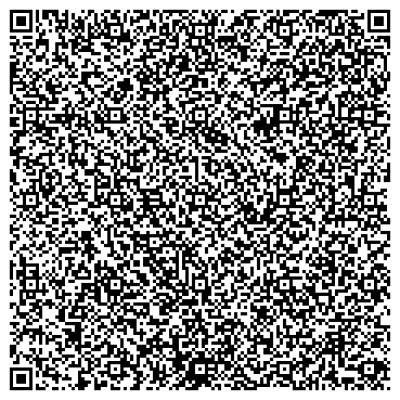

# Eugen
SoftSkills group project  from Tom Holthusen, Tjorven Kämpfer, Maleen Müller, Selin Sezgin and Jana Weber
## Description
Use this code to enable an ESP8266 in along with a 5V 180° servo motor to press the button on your (coffee) machine.
This can either be done via the physical button on the board, or using the Blynk-App.
## Setup
### Firmware
To get the code to run on your ESP8266 you will need to install a couple of libraries.
- [Adafruit BusIO by Adafruit](https://github.com/adafruit/Adafruit_BusIO)
- [Adafruit GFX Library yb Adafruit](https://github.com/adafruit/Adafruit-GFX-Library)
- [Adafruit SSD1306 Wemos Mini OLED by Stefan Bethke](https://github.com/stblassitude/Adafruit_SSD1306_Wemos_OLED)
- [Blynk by Volodomyr Shymanskyy](https://blynk.io/)
- [Servo by Arduino](https://www.arduino.cc/reference/en/libraries/servo/)
- [WiFiManager by Tablatronix](https://github.com/tzapu/WiFiManager)

### Blynk
To setup the Blynk project, simply download the blynk app, and scan this QR-Code:

After you created the Blynk project, you have to setup the [controller board](###controller)

### Controller
If you have the controller board with the installed firmware, you have to connect it to a power source (Micro-USB or LiPo-Batterie). After the controller booted up, you have to use your smartphone and conenct it to the SSID "Eugen".
Following the connection, a webpage will open itself, it should look like this:

Press on the button that says "Configure WiFi", in order to setup the wifi connection for the controller, and to provide the auth token for the Blynk project.
Just select your WiFi and type the password and the Blynk token into the dedicated input fields.

#### Resetting the Controller
If you want to change the WiFi connection of the controller, or the Blynk auth token, just press the button on the controller board for 4 seconds. After that, the controller will reboot and you will need to provide new network credentials, and you can change the blynk token.

## Usage of the App
After you created the blynk project, you will be presented with the following screen:

### Pouring a coffee
The button in the top left corner, can be used, to pour a coffee. Simply press it, and the servo motor of the controller board will turn to press the button on the coffee machine.
Also included in the project, are 4 timer widgets. Each timer widget can be set to a start time, and a stop time. To use the timer to pour a coffee, set its start time to the time of day (24 hour format) you want the coffee. The stop time is not important for the task. Our reccomendation is to set it to 4 seconds after the start time.

### Calibrating the servo
If the servo motor doesn't turn far enough, or to far, it can be calibrated.
In order to toggle the calibration mode, press the big button in the middle, with the label "CalibrationMode".
If the calibration is activated, you first have to set the starting position of the servo. The position can  be controlled in real time, using the slider below the activation button.
If you are satisfied with the starting position, press the button below the slider, to save it.
After that you can use the slider to set the ending position of the servo. Press the button below the slider again to save it, and then press the button above the slider to exit calibration mode.

## Pour a Coffe without the App
If you want to pour yourself a coffee without needing to use the app, you cann always just press the button on your coffee machine. If however that is not possible, you can press the button on the controller board (not longer than 3 seconds!) and the servo motor will push the button for you.